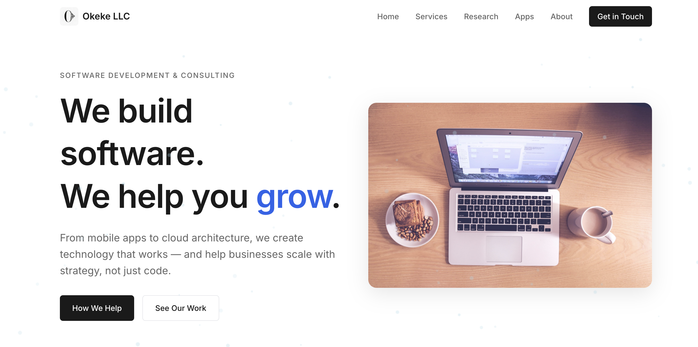
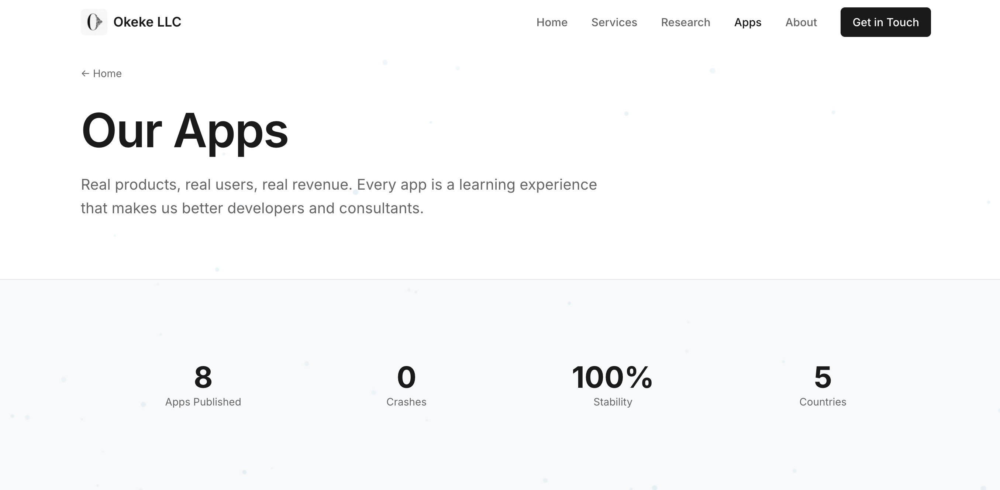
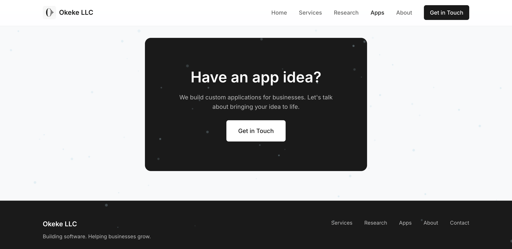

# Portfolio Website Template

A free, modern portfolio website template for developers, consultants, and software companies. Built with clean HTML, CSS, and vanilla JavaScript — no build tools required.

**[Live Demo](https://nice-coast-0382e4910.1.azurestaticapps.net)** | **[Used by Okeke LLC](https://okeke.us)**

---

## Screenshots







---

## Features

### Design
- Clean, professional design with Inter font
- Subtle snowfall animation (respects `prefers-reduced-motion`)
- Fully responsive with mobile hamburger menu
- Two-column hero layout with image
- Collapsible service sections

### Pages Included
| Page | Description |
|------|-------------|
| **Homepage** | Hero section, services overview, featured apps, about preview |
| **Services** | Detailed service offerings with collapsible sections |
| **Research** | Technology focus areas and expertise |
| **Apps** | Portfolio showcase for consumer & business apps |
| **About** | Company story, values, and stats |
| **Contact** | Contact form with spam protection |

### SEO & AI Optimized
- Schema.org structured data (ProfessionalService, WebSite)
- Open Graph & Twitter Card meta tags
- XML sitemap with priority levels
- AI crawler friendly (`robots.txt` allows GPTBot, Claude, Perplexity, etc.)
- Semantic HTML with ARIA labels

### Contact Form
- Powered by [Formspree](https://formspree.io) (free tier: 50 submissions/month)
- Honeypot spam protection (no annoying CAPTCHAs)
- Grouped reason dropdown (Development, Consulting, Growth)
- Optional company field
- Mobile-responsive layout

---

## Quick Start

### 1. Clone the repo
```bash
git clone https://github.com/okekedev/portfoliotemplate.git
cd portfoliotemplate
```

### 2. Run locally
```bash
# Python
python -m http.server 8000

# Or Node.js
npx serve .

# Visit http://localhost:8000
```

### 3. Customize
- Update company name, colors, and content
- Replace images in `/images/`
- Set up your Formspree form (see below)

---

## Customization

### Colors
Edit `styles.css`:
```css
:root {
    --color-primary: #2563eb;    /* Blue accent */
    --color-text: #1a1a1a;       /* Dark text */
    --color-bg-alt: #f8f9fa;     /* Light sections */
}
```

### Contact Form Setup
1. Create a free account at [formspree.io](https://formspree.io)
2. Create a new form
3. Copy your form ID
4. Replace in `contact/index.html`:
```html
<form action="https://formspree.io/f/YOUR_FORM_ID" method="POST">
```

### Snowfall Animation
In each HTML file's `<script>` section:
```javascript
// Adjust opacity (0.15-0.35 = subtle, increase for more visible)
opacity: Math.random() * 0.2 + 0.15

// Adjust particle count
const maxSnowflakes = 100;
```

### Adding Your Apps
Update the apps section with your own projects. App icons can be loaded from Apple's CDN:
```bash
# Get icon URL for any App Store app
curl "https://itunes.apple.com/lookup?id=YOUR_APP_ID" | jq '.results[0].artworkUrl512'
```

---

## Deployment

### Azure Static Web Apps (Recommended)
```bash
# Install Azure CLI if needed
# brew install azure-cli

# Login
az login

# Create resource group
az group create --name website-rg --location "Central US"

# Create static web app (uses your GitHub token)
GH_TOKEN=$(gh auth token) && az staticwebapp create \
  --name your-site-name \
  --resource-group website-rg \
  --source https://github.com/YOUR_USERNAME/portfoliotemplate \
  --branch main \
  --app-location "/" \
  --output-location "/" \
  --token "$GH_TOKEN"
```

Auto-deploys on every push to `main`.

### Other Platforms
Works with any static hosting:
- **Netlify**: Drag & drop or connect GitHub
- **Vercel**: Import from GitHub
- **GitHub Pages**: Enable in repo settings
- **Cloudflare Pages**: Connect GitHub repo

---

## Project Structure

```
portfoliotemplate/
├── index.html              # Homepage
├── styles.css              # Global styles
├── robots.txt              # SEO (allows AI crawlers)
├── sitemap.xml             # XML sitemap
├── staticwebapp.config.json # Azure config
│
├── services/               # Services page
├── research/               # Research/tech page
├── apps/                   # Apps portfolio
│   ├── aircontrolla/       # Individual app pages
│   ├── moviemaker/
│   └── scanprice/
├── about/                  # About page
├── contact/                # Contact page with form
├── images/                 # Site images
└── screenshots/            # README screenshots
```

---

## Credits

This template was created for [Okeke LLC](https://okeke.us), a software development and consulting company. We built it for our own site and decided to share it as a free template for the community.

**Built with:**
- [Inter Font](https://fonts.google.com/specimen/Inter)
- [Formspree](https://formspree.io) for contact forms
- [Azure Static Web Apps](https://azure.microsoft.com/en-us/products/app-service/static) for hosting

---

## License

This project is available under a Research and Educational Use License. See [LICENSE](LICENSE) for details.

**Summary:**
- Free for personal, educational, and research use
- Commercial use requires permission
- Attribution appreciated but not required

For commercial licensing, contact: contact@okeke.us
